# retail-analytics-real

End-to-end analytics on a **real, public, messy** dataset: the UCI *Online Retail II*
transactions of a UK online giftware retailer, December 2009 - December 2011.

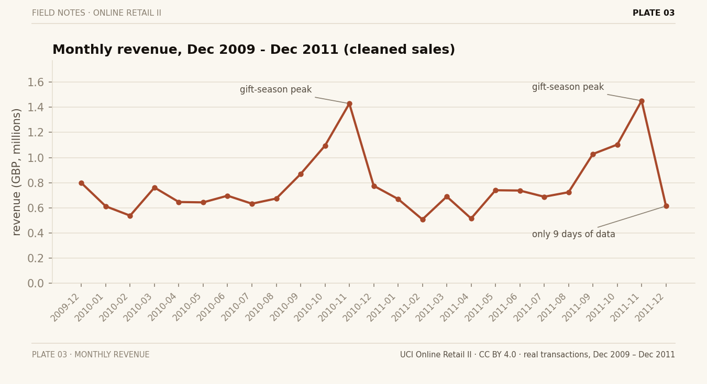

Gift-season peaks in November of both years are annotated — and so is the fact that
December 2011 contains only nine days of data. A naive month-over-month read of the tail
would call it a crash; it's a truncated month.

The short version: **1,067,371** raw rows, **94.0% retained** after a cleaning pipeline
that logs every step's row cost, **GBP 19,643,862** of revenue analyzed — and the honest
forecasting headline is that **seasonal-naive wins** (mean MASE 1.094 vs 1.187 for
Holt-Winters), because one seasonal training cycle is what this data honestly supports.

## Why this repo exists

The rest of my portfolio is built on synthetic data and says so on the label. This repo is
the real-data counterpart: 1,067,371 genuine transaction rows with everything real data
brings — cancellation invoices, negative quantities, ~23% missing customer IDs, bookkeeping
rows pretending to be products, literal `TEST001` rows, and an 80,995-unit order that was
cancelled the same day it was placed. Every cleaning decision below is documented with its
row cost, every model result is out-of-sample, and where a simple baseline wins, I say so.

## The dataset

> Chen, D. (2019). **Online Retail II** [Dataset]. UCI Machine Learning Repository.
> https://doi.org/10.24432/C5CG6D — https://archive.ics.uci.edu/dataset/502/online+retail+ii
> License: **CC BY 4.0**.

The raw xlsx (~45 MB, two sheets: 2009-2010 and 2010-2011) is **not committed** — committing
raw data is bad practice, and this repo does not redistribute the dataset. Fetch it once:

```bash
python scripts/download_data.py
# or:
curl -L -o online_retail_ii.zip "https://archive.ics.uci.edu/static/public/502/online+retail+ii.zip" \
  && unzip online_retail_ii.zip -d data/raw/
```

### Raw quality report (measured, not estimated)

| metric | value |
|---|---|
| rows | 1,067,371 |
| invoices | 53,628 |
| stock codes | 5,305 |
| countries | 43 |
| date range | 2009-12-01 to 2011-12-09 |
| exact duplicate rows | 34,335 |
| missing CustomerID | 243,007 (**22.77%**) |
| cancellation invoices (`C*`) | 19,494 rows (1.83%) |
| negative-quantity rows | 22,950 |
| zero-price rows | 6,202 (plus 5 negative-price) |
| non-product StockCode rows | 5,930 (POST, D, M, DOT, BANK CHARGES, TEST001, gift vouchers, ...) |

## Cleaning: every decision with its row cost

| step | rows in | rows out | removed | % removed |
|---|---:|---:|---:|---:|
| drop exact duplicates | 1,067,371 | 1,033,036 | 34,335 | 3.22% |
| separate cancellations (`C*`) — kept as returns frame | 1,033,036 | 1,013,932 | 19,104 | 1.85% |
| remove non-product StockCodes (explicit list) | 1,013,932 | 1,009,304 | 4,628 | 0.46% |
| drop zero/negative-price rows | 1,009,304 | 1,003,340 | 5,964 | 0.59% |
| drop non-cancellation qty <= 0 | 1,003,340 | 1,003,340 | 0 | 0.00% |
| flag missing CustomerID (kept, never dropped) | 1,003,340 | 1,003,340 | 0 (226,761 flagged) | 0.00% |

Result: **1,003,340 sales rows** (94.0% of raw), **17,914 returns rows**, **GBP 19,643,862**
gross product revenue. Two honest footnotes:

- The "qty <= 0" step removes nothing *on this dataset* — every non-cancellation
  negative-quantity row also had a zero price, so the previous step already caught them.
  The step stays because the pipeline shouldn't rely on that coincidence.
- Missing-CustomerID rows are **flagged, not dropped**: they are real revenue (13.1% of it)
  but can't be attributed to a customer, so they count for revenue/EDA and are excluded
  from RFM only.

## What the data shows (EDA)

Monthly revenue is the chart at the top of this page; the rest of the picture:

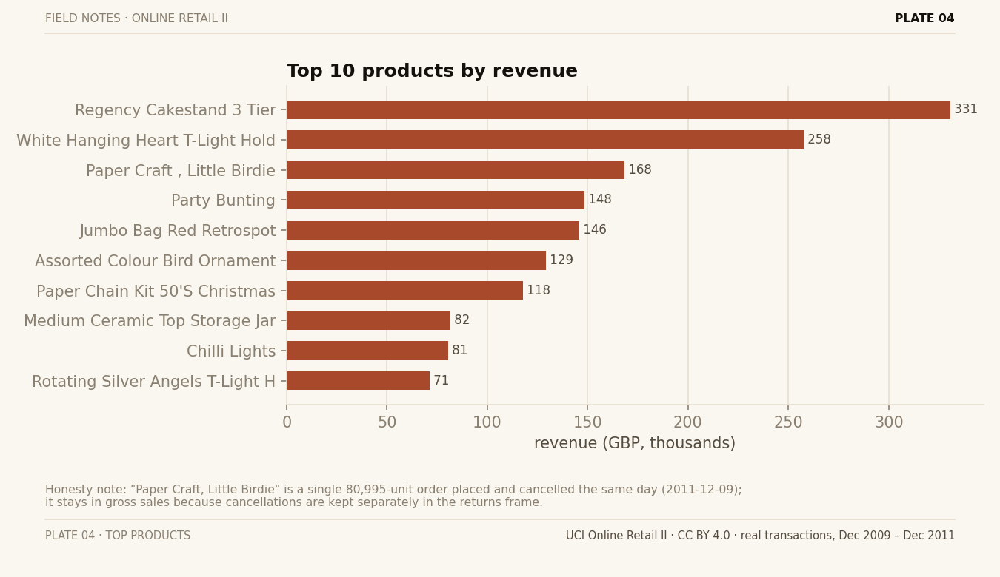

The number-3 product by gross revenue, "Paper Craft, Little Birdie", is a **single
80,995-unit order placed and cancelled the same day** (2011-12-09). It stays in gross sales
because its cancellation lives in the returns frame — a textbook example of why "top
products" charts on this dataset need footnotes.

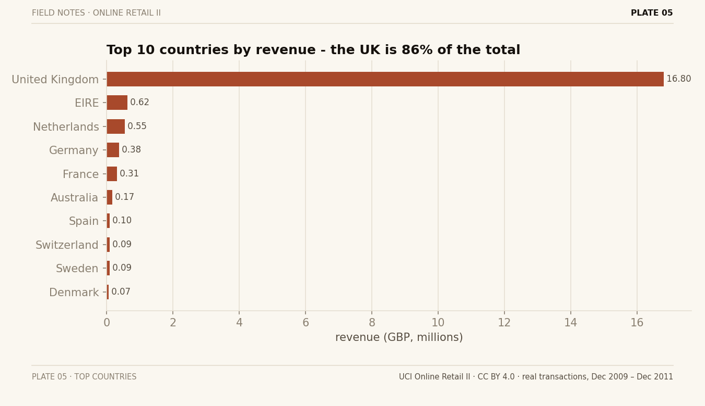
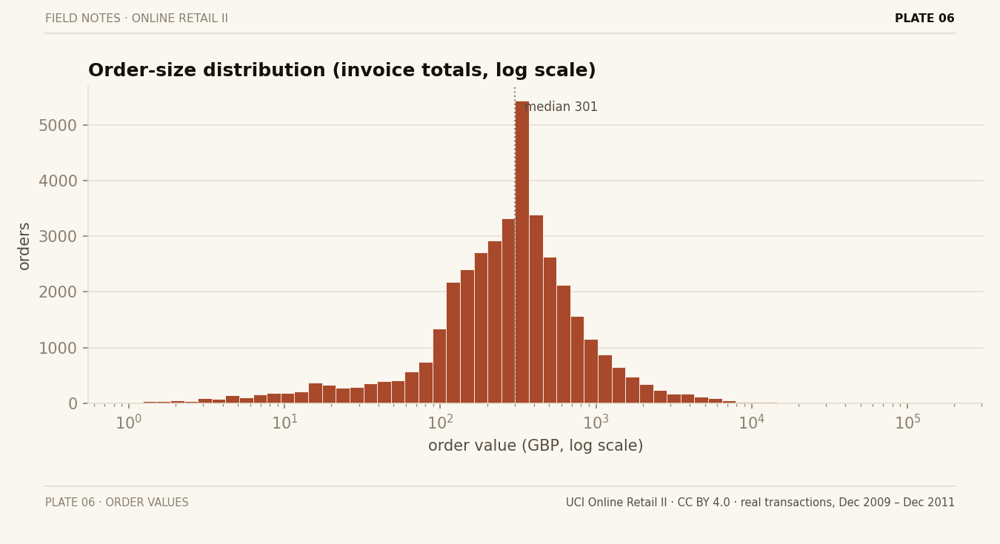
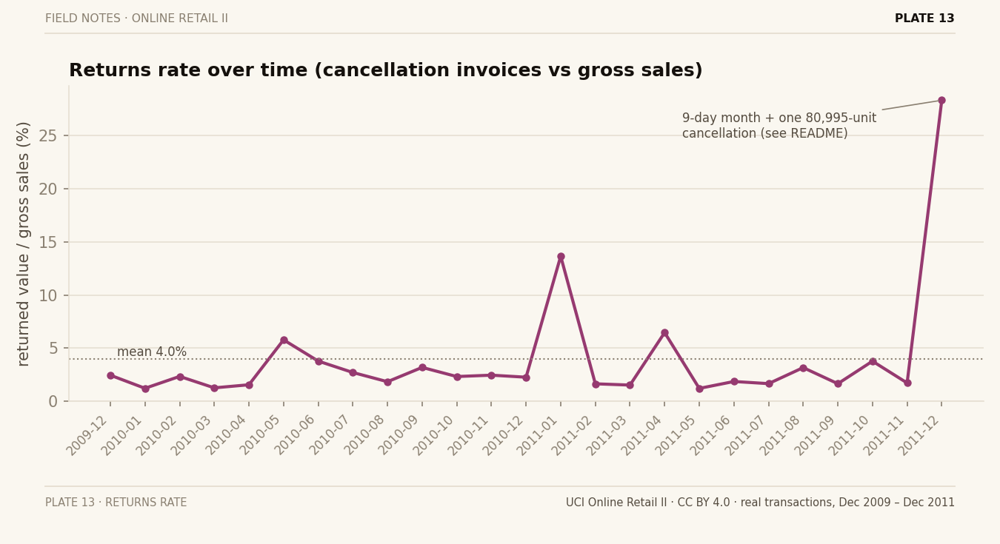
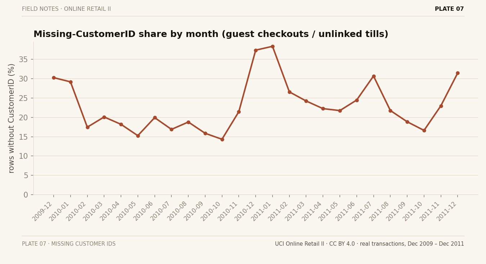

Returns run at **3.65% of gross value overall** (monthly mean 4.0%). The January 2011
(13.6%) and December 2011 (28.3%) spikes are single large cancellations against quiet or
truncated months, not a returns crisis.

## RFM segmentation (from scratch)

Quintile R/F/M scores over the **5,852 customers with a real CustomerID**, mapped to the
standard segment grid. Measured segment table (revenue = identified-customer revenue,
GBP 17.07M = 86.9% of total):

| segment | customers | revenue share |
|---|---:|---:|
| Champions | 1,464 | **69.0%** |
| Loyal Customers | 517 | 9.8% |
| At Risk | 344 | 5.6% |
| Hibernating | 1,172 | 5.3% |
| Potential Loyalist | 710 | 4.8% |
| Need Attention | 458 | 2.7% |
| Lost | 809 | 1.6% |
| About to Sleep | 195 | 0.5% |
| Can't Lose Them | 16 | 0.5% |
| New Customers | 167 | 0.3% |

A quarter of identified customers (Champions) carry 69% of identified revenue — a real
concentration number, not a synthetic one.

## Cohort retention (repeat purchase)

```bash
python -m retail --cohort     # cohort triangle + SVG heatmap/curve + CSV
```

Where RFM is a *snapshot* of who's valuable now, cohort retention is the *time* dimension:
group the **5,852 identified customers** by their first-purchase month, then track what
share of each cohort comes back to buy in each later month. A customer is "retained at
month _k_" if they placed **any** invoice in the calendar month _k_ months after their first
(so this is month-by-month activity retention, not cumulative — skipping a month and
returning the next counts as retained in the month they bought). Offset 0 is the
acquisition month, 100% by definition. Everything is measured from the cleaned real
transactions — nothing modelled.

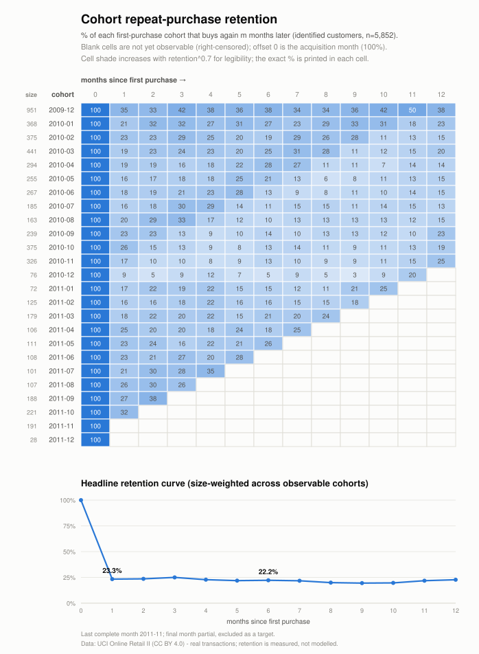

Two honesty guards are built into the numbers, not bolted on after:

- **Right-censoring.** A cohort acquired late can only be observed for a few months. Each
  cell is filled only when its target month is a *complete* month in the data; otherwise
  it's left blank. The headline curve at month _k_ therefore averages only the cohorts old
  enough to have been observed at _k_ — it never counts "hasn't happened yet" as churn.
- **Incomplete final month.** December 2011 holds nine trading days, so it is excluded as a
  target month (last complete month: **2011-11**). No absence in a partial month is scored
  as a lost customer.

**Headline: month-1 repeat rate 23.3%, holding near 22.2% by month 6** (size-weighted across
the cohorts observable at each offset):

| months since first purchase | 1 | 2 | 3 | 4 | 5 | 6 | 9 | 12 |
|---|---:|---:|---:|---:|---:|---:|---:|---:|
| repeat rate | **23.3%** | 23.6% | 25.0% | 22.8% | 21.9% | **22.2%** | 19.4% | 22.7% |

**Plain-language reading.** The striking thing is what *doesn't* happen: the curve barely
decays. For a consumer shop you'd expect month-1 retention to fall off a cliff; here it
plateaus in the low-20s and even **rebounds to 22.7% by month 12**. That is the wholesale
nature of this retailer showing through — a large share of customers are shops that
**re-order on an annual rhythm**, so the year-anniversary month lifts retention back up
rather than letting it fade. The shallow trough is around month 9 (**19.4%**). The launch
cohort (December 2009, 951 customers) is the strongest by far: 35.0% back at month 1,
peaking at **49.6% in November 2010** (its first gift season) and still at 40.6% two years
on — the long-standing wholesale accounts that anchor the base. Later cohorts settle lower
(~15–23% at month 1), which is why the size-weighted average sits at 23.3%.

**Caveats.** Identified customers only — the 22.77% of rows without a `CustomerID` are
structurally invisible here, exactly as in RFM, so this covers the 86.9% of revenue that is
attributable. Single UK gift retailer with wholesale-heavy baskets, so these repeat rates
should not be read as consumer-ecommerce benchmarks. Retention is measured co-purchase
behaviour, not a fitted survival model; the full cohort×month triangle (with cohort sizes
and every censored cell blank) is written to `deliverables/cohort_retention.csv` and the
**Cohort** sheet of the Excel workbook.

## Customer lifecycle: monthly stages & growth accounting

```bash
python -m retail --lifecycle     # monthly stage counts + flow matrix + SVG + CSVs
```

RFM is a *snapshot*, cohort retention the *acquisition-time* view, CLV the
*predictive* leg — this is the **operational** view a CRM team runs a month on:
every identified customer gets exactly one lifecycle stage per calendar month,
and the month-to-month movements between stages are counted into a flow matrix.
A buyer-month is **new** (first in-window purchase), **retained** (bought last
month too) or **resurrected** (back after ≥ 1 silent month); a non-buyer is
**at-risk** (silent 1–3 months) or **dormant** (silent > 3). The 3-month
dormancy threshold is a **documented choice, audited against the data**: the
median gap between a customer's consecutive active months is 2 months, the 75th
percentile is 3, and 78.0% of all comebacks happen within the threshold. The
standard growth-accounting identities do the rest: `churned(m) = active(m-1) −
retained(m)` and quick ratio `= (new + resurrected) / churned`.

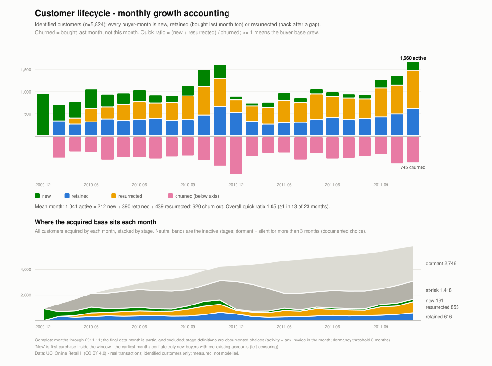

**Headline (measured, 5,824 identified customers over 24 complete months):
the average month has 1,041 active buyers = 212 new + 390 retained + 439
resurrected, while 620 lapse — an overall quick ratio of 1.05**, above 1.0 in 13
of 23 scored months. The striking number is the middle one: **in a typical month
more buyers are *resurrections* than month-over-month repeats** (439 vs 390).
This is the cohort analysis' annual-rhythm plateau seen from the operations
side: for a wholesale-heavy customer base, skipping months is *normal
purchasing behaviour*, and a CRM that treats every one-month absence as churn
would misread most of this base.

The aggregate month-to-month flow matrix (customers, all 23 complete month
pairs — rows are the stage in month *m−1*, columns the stage in month *m*):

| from \ to | new | retained | resurrected | at-risk | dormant |
|---|---:|---:|---:|---:|---:|
| (pre-acquisition) | 4,873 | – | – | – | – |
| new | – | 1,315 | – | 4,318 | – |
| retained | – | 4,958 | – | 3,386 | – |
| resurrected | – | 2,687 | – | 6,565 | – |
| at-risk | – | – | 7,139 | 16,795 | 5,712 |
| dormant | – | – | 2,966 | – | 30,459 |

Reading it as monthly rates: a **new** customer buys again next month 23.3% of
the time (independently confirming the cohort month-1 repeat rate of 23.3% —
two modules, one measured truth), a **retained** customer stays retained 59.4%
of the time, an **at-risk** customer resurrects next month 24.1% of the time —
and even **dormant** customers come back at 8.9% *per month*: 2,966 of the
10,105 resurrections (29.4%) return from more than 3 months of silence.
**Dormant is not dead here**, which is exactly what the annual re-order rhythm
should look like in a flow matrix. The dashes are structural zeros (e.g. only
pre-acquisition can flow into "new"; an active month followed by an active
month is "retained" by definition) — the test suite asserts them.

Two more measured views the table gives for free:

- **Revenue by stage.** Of the GBP 16.56M identified-customer revenue in
  complete months, **51.2% comes from retained buyer-months, 31.2% from
  resurrected and 17.6% from new** — nearly a third of attributable revenue
  each month is customers *coming back from a gap*, not steady monthly buyers.
- **The December cliff is real but self-healing.** December 2010 is the worst
  churn month on the books (1,082 lapse; quick ratio 0.33) — wholesale buyers
  stop ordering after the gift season. The at-risk pool jumps to 2,164, and the
  next quarter's resurrections (344, 372, 504) pull most of it back. The best
  month is September 2011 (quick ratio 1.64), stock-up season starting.

**Caveats.** Identified customers only, as everywhere (the 22.8% of rows with
no `CustomerID` are structurally invisible); 28 customers first seen in the
partial December 2011 are excluded, so the base is 5,824 rather than 5,852.
"New" means *first purchase inside the observation window* — the earliest
months conflate genuinely-new buyers with pre-existing accounts the window
can't see (left-censoring; the December 2009 "951 new customers" are simply the
launch-month actives). Stage definitions are definitional choices (activity =
any invoice in the calendar month; threshold 3 months), configurable and
printed on every output — they are a lens, not a behavioural truth. The full
monthly table is `deliverables/lifecycle_stages.csv`, the flow matrix
`deliverables/lifecycle_flows.csv`, and both live on the **Lifecycle** sheet of
the Excel workbook.

## Predictive customer lifetime value

```bash
python -m retail --clv     # BG/NBD + Gamma-Gamma fit, out-of-sample holdout check, figure + CSV
```

RFM is a *snapshot* of who is valuable now; cohort retention is the *descriptive* time
dimension. CLV is the *predictive* leg: it turns each customer's history into an expected
number of future transactions and an expected value per transaction, and multiplies them
into an expected forward revenue. Two from-scratch models, the standard pairing, numpy /
pandas / scipy only (no `lifetimes`, no ML library):

- **BG/NBD** (Fader, Hardie & Lee 2005) models *how many* future transactions each customer
  makes, from three sufficient statistics measured off the cleaned sales — repeat frequency,
  recency (first→last purchase, in days) and age *T* (first purchase→observation end). The
  four population parameters are fit by maximum likelihood; the fit is deterministic (fixed
  start, so it reproduces byte-for-byte). Multiple invoices on the same day count once.
- **Gamma-Gamma** (Fader & Hardie 2013) models *how much* each transaction is worth, under
  the assumption that a customer's average transaction value is independent of their purchase
  frequency — an assumption this repo **measures** rather than asserts: the frequency-vs-value
  correlation on the real data is **0.020**, essentially the zero the model wants.

`CLV(horizon) = E[transactions over horizon] × E[value per transaction]`, over the next
**180 days**, on the **5,852 identified customers** (4,179 repeat, 1,673 one-time).

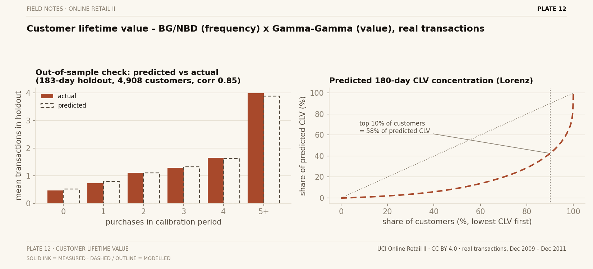

**The honest headline is the out-of-sample check, not the fit.** The window is split into a
*calibration* period (through **2011-05-31**) and a later **183-day holdout** (to the last
complete month, **2011-11-30**, so no absence in the partial final month is scored as a lost
sale). BG/NBD is fit on calibration only, then asked how many transactions each of the
**4,908** then-existing customers would make in the holdout. Measured against what actually
happened:

| calibration purchases | customers | predicted mean | actual mean |
|---|---:|---:|---:|
| 0 | 1,606 | 0.510 | 0.460 |
| 1 | 883 | 0.781 | 0.717 |
| 2 | 563 | 1.100 | 1.098 |
| 3 | 407 | 1.320 | 1.285 |
| 4 | 307 | 1.619 | 1.638 |
| 5+ | 1,142 | 3.881 | 3.981 |

In aggregate the model predicted **7,594 holdout transactions against an actual 7,562 — 0.4%
over**, with a per-customer predicted-vs-actual correlation of **0.85** and a mean absolute
error of **1.03 transactions**. That is a genuine forward prediction validated on data the
fit never saw, and it tracks the real curve closely across every frequency bucket.

**Fitted parameters (measured):** BG/NBD `r=0.669, α=63.87, a=0.110, b=2.433`; Gamma-Gamma
`p=2.228, q=3.488, v=443.6`, implying an expected transaction value of **GBP 397** across the
population. The predicted 180-day revenue over all identified customers totals **GBP
4,508,842**, and it is **heavily concentrated: the top 10% of customers by predicted CLV
carry 57.5% of it, the top 20% carry 71.2%** — the same wholesale-anchored concentration RFM
and cohort both show, now expressed as forward pounds. The single highest-CLV customer
(18102: 66 repeat purchases, ~GBP 8,800 per order) is predicted at about **GBP 127,000** of
revenue over the next six months.

**Caveats before anyone budgets against these numbers.** CLV here is **gross revenue, not
profit** — this dataset carries no cost data, so no margin is modelled and none is invented.
The horizon is finite (180 days) and **undiscounted**: it is a "next-six-months expected
revenue", not an infinite-horizon discounted figure that would need a made-up discount rate.
BG/NBD assumes Poisson purchasing with a beta-distributed dropout after each purchase, and
Gamma-Gamma assumes value/frequency independence (checked above); both are approximations of
a single UK gift-and-wholesale retailer, not laws. And as everywhere else, **identified
customers only** — the 22.8% of rows without a `CustomerID` are structurally invisible. The
full per-customer table (frequency, recency, T, P(alive), predicted purchases, predicted
value, CLV) is written to `deliverables/customer_lifetime_value.csv` and the **CLV** sheet of
the Excel workbook.

## Forecasting: honest, leakage-safe, MASE-scored

Weekly revenue (104 complete weeks; the two partial edge weeks are dropped), rolling-origin
CV with 5 folds, horizon 8 weeks, training strictly before each origin. All models
implemented from scratch (numpy/pandas only). MASE is scaled by the in-sample one-step
error of the seasonal-naive walk (m=52) on each fold's training window.

**MASE per fold (lower is better):**

| fold (origin, train weeks) | seasonal-naive | Holt-Winters | lag-features OLS |
|---|---:|---:|---:|
| 1 (2011-03-06, 64) | **0.651** | 0.702 | 1.515 |
| 2 (2011-05-01, 72) | **1.404** | 1.745 | 1.990 |
| 3 (2011-06-26, 80) | **0.887** | 0.952 | 0.907 |
| 4 (2011-08-21, 88) | 1.732 | **1.410** | 1.558 |
| 5 (2011-10-16, 96) | **0.796** | 1.126 | 1.981 |
| **mean** | **1.094** | 1.187 | 1.590 |

**The honest headline: seasonal-naive wins.** It takes 4 of 5 folds and the best mean MASE.
Holt-Winters (additive, m=52, smoothing tuned on the training tail only) beats it on one
fold and loses overall; the lag-features linear model never wins. With exactly one full
seasonal cycle available for training, "same week last year" is genuinely hard to beat —
a modest, real result, which is the point of this repo. A mean MASE around 1.1 means
8-week-ahead forecasts carry about the same error as a one-week seasonal walk does
in-sample; nobody should claim precision forecasting on 104 weekly points with one
Christmas per training window.

Per-SKU weekly demand for the top 10 SKUs is in the deliverables, with intermittency
(zero-week share) noted per SKU. A 4-week moving average or the naive walk wins on most of
them; SKU 23843 is unforecastable by construction (one giant cancelled order).

## What actually sells together

```bash
python -m retail --basket
```

Market-basket analysis on the real invoices. The mining engine — from-scratch Apriori with
downward-closure pruning, plus an independent from-scratch FP-growth implementation as a
cross-check — is adapted from my
[market-basket-analysis](https://github.com/Dimitres-Kisimov/market-basket-analysis) repo,
which ran it on 14 synthetic categories. Here it runs on real SKUs, so the item universe is
a documented choice, not a default: **the top 200 stock codes by cleaned gross revenue**
(5,305 codes total; product level would drown in rare items), each labelled with its most
frequent normalised description, codes with identical descriptions merged. A basket is one
sales invoice reduced to tracked items; invoices with fewer than two tracked items cannot
express a co-purchase and are excluded. Survivors, measured:

- 39,516 sales invoices -> 34,394 contain at least one top-200 SKU -> **29,639 baskets**
  with >= 2 tracked items (mean basket size 8.6 tracked items — wholesale-sized).
- Min support **1% of baskets (>= 297 invoices)**: 197 frequent single items, 859 pairs,
  278 triples. At 2% only 133 pairs survive; at 0.5% it balloons to 4,196 pairs and the
  tail turns noisy — 1% is the documented middle, not a magic number.
- **1,222 directed rules** (565 distinct item sets) kept at confidence >= 30% and
  lift >= 1.10. Support/confidence/lift/leverage/conviction all computed from scratch.
- FP-growth on a seeded 5,000-basket sample returns **identical itemsets and supports**
  to Apriori (also asserted in the test suite on the fixture).
- Rules backed by < 30 invoices get flagged `thin_support`. At these thresholds **none
  trigger** — min support already guarantees >= 297 invoices; the flag only matters if
  you lower support below ~0.1%.

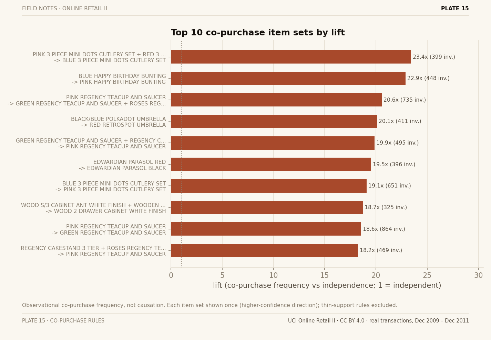

Top 10 item sets by lift (higher-confidence direction shown; both directions of a set
share support and lift):

| # | rule | support | invoices | confidence | lift |
|---|---|---:|---:|---:|---:|
| 1 | PINK + RED 3 PIECE MINI DOTS CUTLERY SET -> BLUE | 1.35% | 399 | 74.3% | **23.4** |
| 2 | BLUE HAPPY BIRTHDAY BUNTING -> PINK HAPPY BIRTHDAY BUNTING | 1.51% | 448 | 66.3% | **22.9** |
| 3 | PINK REGENCY TEACUP AND SAUCER -> GREEN + ROSES REGENCY TEACUP AND SAUCER | 2.48% | 735 | 71.8% | **20.6** |
| 4 | BLACK/BLUE POLKADOT UMBRELLA -> RED RETROSPOT UMBRELLA | 1.39% | 411 | 60.5% | **20.1** |
| 5 | GREEN REGENCY TEACUP AND SAUCER + REGENCY CAKESTAND 3 TIER -> PINK REGENCY TEACUP AND SAUCER | 1.67% | 495 | 68.7% | **19.9** |
| 6 | EDWARDIAN PARASOL RED -> EDWARDIAN PARASOL BLACK | 1.34% | 396 | 55.8% | **19.5** |
| 7 | BLUE 3 PIECE MINI DOTS CUTLERY SET -> PINK 3 PIECE MINI DOTS CUTLERY SET | 2.20% | 651 | 69.3% | **19.1** |
| 8 | WOOD S/3 CABINET ANT WHITE FINISH + WOODEN PICTURE FRAME WHITE FINISH -> WOOD 2 DRAWER CABINET WHITE FINISH | 1.10% | 325 | 70.0% | **18.7** |
| 9 | PINK REGENCY TEACUP AND SAUCER -> GREEN REGENCY TEACUP AND SAUCER | 2.92% | 864 | 84.4% | **18.6** |
| 10 | REGENCY CAKESTAND 3 TIER + ROSES REGENCY TEACUP AND SAUCER -> PINK REGENCY TEACUP AND SAUCER | 1.58% | 469 | 63.0% | **18.2** |

**Plain-language reading.** This is a gift retailer selling to (largely) wholesale buyers,
and the top of the lift table says one thing loudly: **buyers stock colour and design
variants of the same product together**. The mini-dots cutlery sets in blue/pink/red, the
happy-birthday bunting in blue/pink, the Edwardian parasols, the polkadot/retrospot
umbrellas, the white-finish wooden furniture — all variant families. The Regency tea-set
family (teacups in pink/green/roses, the 3-tier cakestand, teapot) is the closest thing to
a true cross-product bundle, and even that is one design line being bought as a set. A
shop buying the pink Regency teacup goes on to take the green one 84% of the time.

**Honest comparison with the synthetic repo.** The synthetic generator planted category
bundles (fasteners + power tools + gloves) and mining recovered them at lifts of about
1.5-2.4 with 30-80% confidence — realistic for 14 broad *categories*, where baselines are
high. On real SKUs the same engine reports lifts of **18-23**, roughly ten times larger,
simply because each single item appears in only 3-5% of baskets, so co-occurring at 1.5-3%
is dozens of times above independence. What genuinely surprised me: I expected classic
complement pairs (teapot -> teacups is the shape of story the synthetic data planted);
instead the real signal is almost entirely **variant collecting within an assortment**,
plus one strong asymmetry the synthetic data never produced — rules point from the rarer
variant to the more popular one with much higher confidence than the reverse (pink Regency
-> green at 84%, green -> pink at only 64%), which is exactly what a "core colour +
optional extra colour" buying pattern looks like.

**Caveats before anyone reprices a shelf:** single UK gift retailer, wholesale quantities
(one basket is often a shop's stock order, not a consumer's), gift-season concentration,
and support fractions are shares of *multi-item invoices over the tracked top-200
assortment*, not of all invoices. Above all: lift is co-purchase frequency versus
independence — **correlation, not causation**. Nothing here proves that stocking blue
cutlery *makes* anyone buy pink cutlery.

## Returns & cancellations

```bash
python -m retail --returns     # return rates + reverse-logistics lag + per-SKU CSV/figure
```

The cleaning pipeline never throws cancellations away — it *separates* the `C`-prefixed
invoices into a first-class **returns frame** (17,914 product rows). This is the analysis
that frame was kept for: returns measured against sales, from scratch, on the same cleaned
data everything else uses.

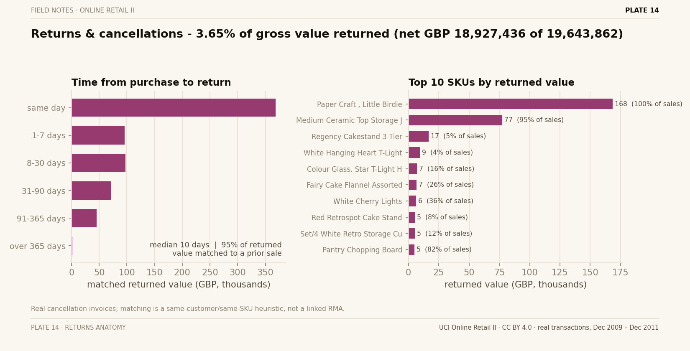

**Headline (measured):** returns run at **3.65% of gross value** (GBP 716,426 of GBP
19,643,862 — leaving **GBP 18,927,436 net**) and **4.18% of units**, across **17,914 return
lines in 7,405 cancellation invoices**.

**Reverse-logistics lag — matching credit notes to their sale.** Online Retail II credit
notes carry *no reference* to the invoice they cancel, so a return is attributed to a sale
**heuristically**: the most recent prior sale of the **same StockCode to the same
CustomerID**, on or before the cancellation date (a backward as-of join). On that basis
**95.0% of returned value** (89.6% of lines, 16,056 of 17,914) matches a prior purchase, at
a **median of 10 days to return** (p25 4 days, p75 30 days; the mean of 31.6 is pulled up by
a thin long tail). The distribution:

| time from purchase to return | same day | 1–7 days | 8–30 days | 31–90 days | 91–365 days | > 365 days |
|---|---:|---:|---:|---:|---:|---:|
| share of matched return lines | 10.9% | 31.0% | 33.3% | 15.7% | 8.5% | 0.6% |

Three-quarters of returns come back within a month; a small tail (0.6%) is a year or more
later — consistent with wholesale restock corrections, not consumer buyer's-remorse.

**Which products come back.** Returned value is concentrated: the **top 10 SKUs carry 42.9%**
of it and **313 SKUs cover 80%** (of 2,885 SKUs ever returned). The top of that table is
dominated by the two known giant same-day cancellations — the same footnote the "top
products" chart carries:

| # | SKU | product | units returned | value-return rate |
|---|---|---|---:|---:|
| 1 | 23843 | PAPER CRAFT, LITTLE BIRDIE | 80,995 | **100%** |
| 2 | 23166 | MEDIUM CERAMIC TOP STORAGE JAR | 74,494 | **94.8%** |
| 3 | 22423 | REGENCY CAKESTAND 3 TIER | 1,450 | 5.0% |

SKU 23843 is the 80,995-unit order placed and cancelled on the same day (2011-12-09): the
returns analysis surfaces it correctly at a 100% return rate, a check that the matching and
rates are reading the real data, not smoothing it. Return rates also vary by market — France
**5.68%**, the UK **3.76%**, EIRE **3.26%**, Germany **2.27%**, versus the Netherlands
**0.67%** and Australia **0.90%**.

**Caveats.** Matching is a **heuristic attribution, not a linked RMA** — the data has no key
from a credit note to its originating invoice; 328 return lines carry no `CustomerID` and
can't be attributed to a buyer, and ~1,500 identified lines find no prior same-SKU sale (the
sale predates the window, or sits under a different/blank id). Those are reported as
unmatched, never forced onto a sale. The return rate is `returned / gross` over the **same
cleaned universe** — it is *not* a per-order refund probability, and because a credit note
can post in a quieter (or truncated) month than its sale, the *monthly* rate can exceed 100%;
that is a timing artefact, annotated in the EDA chart, not hidden. As everywhere, single UK
gift/wholesale retailer — **correlation, not causation**. The full per-SKU table (sold vs
returned units and value, with both return rates) is written to
`deliverables/returns_analysis.csv` and the **Returns** sheet of the Excel workbook.

## Price ladders — the same SKU at many prices

```bash
python -m retail --pricing     # ladders + price realization + two price/quantity slopes
```

`Price` in this dataset is not a property of a product — it is a property of a *line*.
**4,342 of 4,895 SKUs (88.7%) sold at more than one price**, so before anything can be
said about pricing, the ladder has to be measured: every rung a SKU was actually charged
at, with the units and revenue that sat on it.

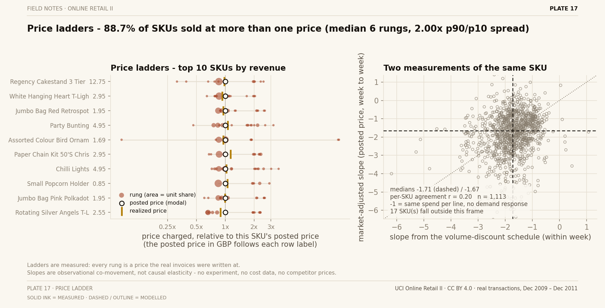

**The ladder (measured).** Restricting to SKUs with a real ladder — **≥ 4 distinct prices
and ≥ 200 invoice lines**, which is **1,342 SKUs carrying 79.7% of revenue (GBP
15,653,663)** — the median SKU has **6 rungs** and a **p90/p10 price spread of 2.00×**: the
high price a SKU sells at is typically double its low one. Against each SKU's **posted
price** (the modal rung by lines — the price most invoice lines were written at),
**39.5% of units sold below it, 51.5% at it, 9.0% above it**.

**Price realization is 98.6% — and that is not an opportunity.** The same units repriced at
their SKU's posted price would total GBP 15,870,272 against the GBP 15,653,663 actually
booked: a gap of **GBP 216,608, or 1.4%**. That is *arithmetic on the units that did sell*,
not a forecast about units that did not — and the slopes below are the reason the arithmetic
must not be read as money left on the table.

**Two price/quantity slopes, kept apart on purpose.** Both are log-log OLS per SKU, on the
1,113 SKUs with enough weekly variation to fit:

| slope | what varies | median | reading |
|---|---|---:|---|
| within week | one buyer vs another, same week | **-1.71** | the seller's own volume-discount schedule |
| posted price, week to week | the posted price moved | **-1.78** | co-movement, confounded with season |
| market-adjusted | as above, minus the assortment's weekly unit index | **-1.67** | the closest thing here to a demand answer |

**96.0%** of market-adjusted slopes are negative, and **825 of 1,113 SKUs (74.1%)** beat
their own permutation null — units reshuffled across that SKU's own weeks, 199 seeded draws
each — at p ≤ 0.05. So there *is* signal beyond noise.

**The honest part is what the slopes do not license.** Read **-1.0 as the benchmark, not
zero**: a buyer who spends the same amount per line whatever the price produces a slope of
exactly -1 with no demand response at all. The within-week number (-1.71) is measured on
variation that contains **no price change** — it is the discount schedule alone — and it
lands within 0.04 of the market-adjusted number. And per SKU the two measurements correlate
at only **r = 0.20**: they agree about the assortment and disagree about almost every
individual product. That is why plate 17 draws them against each other rather than reporting
one of them: this data supports an **assortment-level statement, not a per-SKU price
recommendation**.

**Caveats.** Prices here were never randomised — there is no experiment, no cost data, no
competitor prices, no stock levels, so **nothing here is an elasticity and nothing here is
causal**. Wholesale and retail orders are mixed, so one SKU's ladder spans two different
kinds of buyer. "Posted price" is a documented choice (modal by lines, ties to the lower
rung), not a price list the retailer published. 553 SKUs sold at exactly one price and are
outside this view entirely, and blank slopes in the table are SKUs whose posted price barely
moved week to week — no slope was fitted rather than a fragile one reported. The full
per-SKU table (rungs, posted vs realized price, spread, unit split, all three slopes and the
permutation p-value) is written to `deliverables/price_ladder.csv` and the **PriceLadder**
sheet of the Excel workbook.

## Data-quality report card

```bash
python -m retail --report-card     # scores the data BEFORE and AFTER cleaning
```

A **generic, config-driven** module (`retail/quality.py`) that scores any pandas
DataFrame across five standard dimensions and renders a report card. It is
dataset-agnostic — give it a frame and an optional config (per-column expected
type, range/regex/domain, key columns, a few cross-field rules) — and here it is
pointed at the real UCI data to make the cleaning pipeline's value *measurable*.

**It is a heuristic scorecard with stated weights and stated rules, NOT a
certification of data correctness.** A high score means the data *passed the
declared checks*, not that the data is true. That caveat is printed on the card
header and in the module docstring.

Every check scores `100 * (1 - violations / evaluated)`; a dimension's score is
the mean of its checks, and the overall score is a weighted mean with **explicit,
documented weights** — Completeness **0.30**, Validity **0.25**, Consistency
**0.20**, Uniqueness **0.15**, Plausibility **0.10** (renormalised over the
dimensions that actually run). A dimension's status is its *worst* check, and the
letter grade is **capped** by the worst hard-dimension status (a failing hard
check caps at C, a warning at B). Plausibility is an **outlier heuristic**
(3×IQR) — it never hard-fails and never caps the grade.

Measured on the full dataset (same config applied to both frames):

| dimension | raw | cleaned | what moved |
|---|---:|---:|---|
| Completeness | 100.0 [OK] | 100.0 [OK] | unchanged by design (see note) |
| Validity | 100.0 [OK] | 100.0 [OK] | types/ranges already conform per-row |
| Uniqueness | 96.8 **[FAIL]** | 100.0 [OK] | **34,335 exact duplicate rows removed** |
| Consistency | 99.1 [WARN] | 100.0 [OK] | **22,950 non-positive qty + 6,207 bad prices resolved** |
| Plausibility (heuristic) | 96.7 [WARN] | 97.1 [WARN] | extreme outliers remain (not errors) |
| **Overall grade** | **C (99.0)** | **A (99.7)** | **raw C → cleaned A** |

**Honest reading.** The per-*row* scores are all high because real-data problems
are concentrated in a *minority* of rows — which is exactly what the pipeline
removes. The letter grade, not the raw score, tells the story: raw data fails on
duplicates and warns on sign errors, so it is capped to **C**; the cleaned frame
passes every hard check and earns an **A**. Two honest footnotes, on brand:

- **Completeness does not move.** Missing `CustomerID` (declared *nullable*) is
  kept by design — flagged, never dropped — so cleaning can't and shouldn't lift
  completeness. The lift is entirely in Uniqueness and Consistency.
- **The cleaned data is not "perfect".** Plausibility still warns: ~2–4% of
  `Quantity`/`Price` values are extreme outliers by the 3×IQR rule. Those are
  large legitimate wholesale orders, not errors — so the check is labelled a
  heuristic and the card reports them rather than claiming a spotless dataset.

The full before/after card is written to `deliverables/data_quality_report_card.md`
and, inside the pipeline, to the **DataQuality** sheet of the Excel workbook
(screen == export). The module is self-contained and reusable on any dataset.

## Deliverables

```bash
python -m retail --deliverables
```

produces `deliverables/retail_analytics_executive.pdf` (executive briefing: citation,
cleaning-impact table, forecast + CV results, RFM, cohort retention, CLV, returns, top SKUs),
`deliverables/retail_analytics.xlsx` (sheets: CleaningReport, MonthlyRevenue, RFM, Cohort —
the full cohort×month retention triangle with sizes and the size-weighted curve — Lifecycle —
the monthly stage counts with churn/quick-ratio and the aggregate stage-flow matrix — CLV — the
BG/NBD + Gamma-Gamma parameters, the out-of-sample holdout check and the top customers by
predicted value — Returns — the headline rates, reverse-logistics lag buckets and the full
per-SKU sold-vs-returned table — ForecastCV, TopSKUs, Rules — all 1,222 association rules with
metrics and the thin-support flag — DataQuality — the raw-vs-cleaned report card with
per-dimension lift and the flat findings list — and WeeklyRevenue),
`deliverables/cohort_retention.csv` (the same triangle as a flat CSV),
`deliverables/lifecycle_stages.csv` + `deliverables/lifecycle_flows.csv` (the monthly
lifecycle table and stage-flow matrix),
`deliverables/customer_lifetime_value.csv` (the full per-customer CLV table),
`deliverables/returns_analysis.csv` (the full per-SKU returns table) and
`deliverables/price_ladder.csv` (the full per-SKU price ladder with both slopes and the
permutation p-value; the same numbers land in the **PriceLadder** sheet). The basket, cohort,
lifecycle, CLV, returns, pricing and report-card steps run inside the pipeline, so every sheet is
always current.

## Reproduce

```bash
pip install -r requirements.txt
python scripts/download_data.py    # one-time, ~45 MB from UCI
python -m retail --deliverables    # full pipeline: ~1.5 min first run (xlsx parse), ~45 s after
python -m retail --basket          # market-basket analysis only (skips politely if data absent)
python -m retail --cohort          # cohort repeat-purchase retention only (skips politely if absent)
python -m retail --lifecycle       # lifecycle stages & growth accounting only (skips politely if absent)
python -m retail --clv             # customer lifetime value only (skips politely if absent)
python -m retail --returns         # returns & cancellations analysis only (skips politely if absent)
python -m retail --pricing         # price ladders + price/quantity slopes (skips politely if absent)
pytest -q                          # 143 tests, fixture-based, no download needed
ruff check .
```

Tests run on `tests/fixtures/sample.csv` — 1,950 real rows drawn deterministically from the
dataset (seed 42, stratified to include every kind of mess). CI does not download the full
dataset; the one full-data test skips itself cleanly when `data/raw/` is absent.

## Limitations (read before reusing any number)

- **Single retailer, single channel** — one UK-based online giftware wholesaler/retailer.
  Nothing here generalises to other retailers without re-measurement.
- **UK-centric**: 86% of revenue is domestic UK.
- **Gift-heavy seasonality with only one full cycle in training** — the main reason
  seasonal-naive is the strongest forecaster; two years of data cannot validate a
  second seasonal cycle.
- **The final month is incomplete** (9 days of December 2011) and is annotated, not hidden.
- **22.77% of rows have no CustomerID**, so RFM, cohort and CLV cover the 86.9% of revenue
  that is attributable; the rest is structurally invisible to customer analytics.
- **Lifecycle stages are a declared lens, not a behavioural truth** — activity is "any
  invoice in the calendar month" and dormancy is "> 3 silent months" (a choice audited
  against the measured gap distribution, but still a choice). "New" is left-censored:
  first purchase *inside the window*, so the earliest months overstate genuinely-new buyers.
- **CLV is gross revenue, not profit** — no cost data exists, so no margin is modelled — and
  it is a finite, undiscounted 180-day horizon, not an infinite-horizon discounted figure.
  Its holdout error is 0.4% in aggregate, but that is one retailer over one 183-day window.
- **Wholesale and retail orders are mixed** and not separable with certainty (many
  customers are wholesalers, hence 80k-unit orders).
- Prices are nominal GBP; no inflation or FX adjustment.
- **The price/quantity slopes are observational, not elasticities** — prices were never
  randomised, wholesale and retail buyers are mixed in the same ladder, and the two
  independent measurements correlate at only r = 0.20 per SKU. They support an
  assortment-level reading; they do not price an individual SKU.

## License

Code: © 2026 Dimitres Kisimov — all rights reserved; published for portfolio review. See LICENSE. Data: **CC BY 4.0**, © the dataset authors via the UCI Machine
Learning Repository — cited above and **not redistributed in this repository**.
